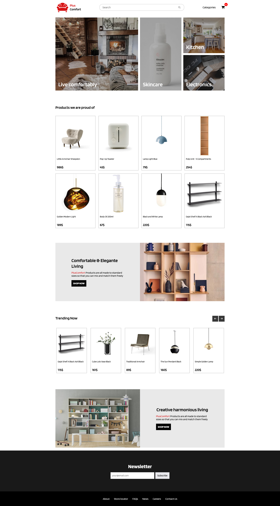

<h1>PlusComfort</h1>

<h2>About the project</h2>

This is an online furniture store website built with React and CSS. This
website features a modern and intuitive design, with easy-to-use navigation and a
simple shopping experience that puts the focus on the products
  

<h3>Tags:</h3>

- React JS
- React-router-dom v6
- React Context
- Local storage

<h2>Screenshots of the Project 📸</h2>
<h3 align='center'>Home Page 🏡</h3>

<h3 align='center'>Categories Page 📃</h3>

<h3 align='center'>Product Page &#128187;</h3>

<h3 align='center'>Shopping cart modal &#128176;‍</h3>

